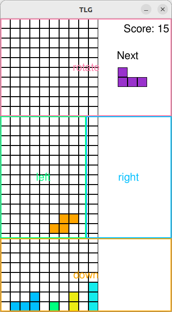

### Tetrils like game

*Simple pygame tetris game.*

Mostly to play around with some AI coding tools to see what they can do.  I'd guess I built this about twice as fast as I would have if I didn't have the assistants help me along.  And much less likely for me to abaondon the project, as I'm constantly making progress.

## It's live!

See a live demo of it (running via [Pygbag](https://pygame-web.github.io/) and web assembly) at https://diederikjh.github.io/tlg/   Warning quite CPU intensive via web assembly

## Mobile controls

The mobile version of the game has four control areas as seen above.  Tap the screen on the given area, to move shape left or right or rotate it, or make it move down faster.

As with normal browsers, pygbag is quite CPU intensive, so watch your mobile's batter life.
